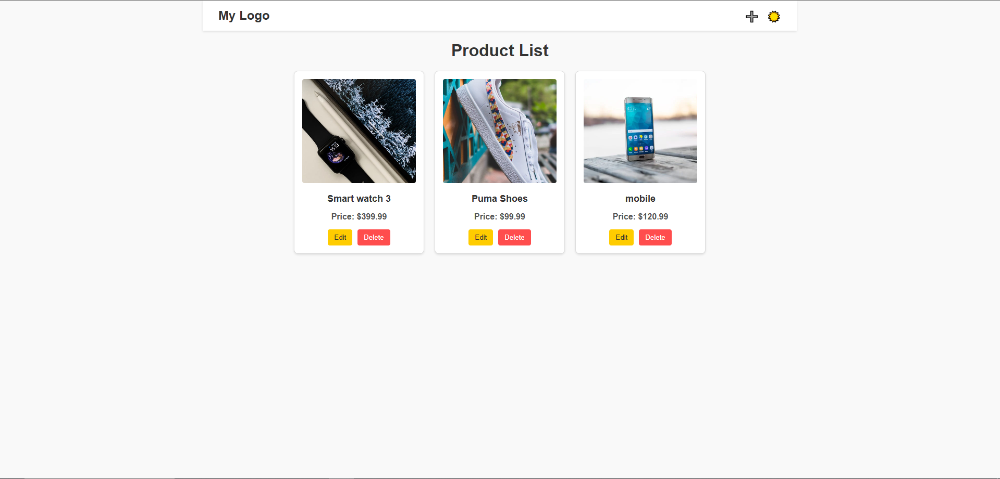
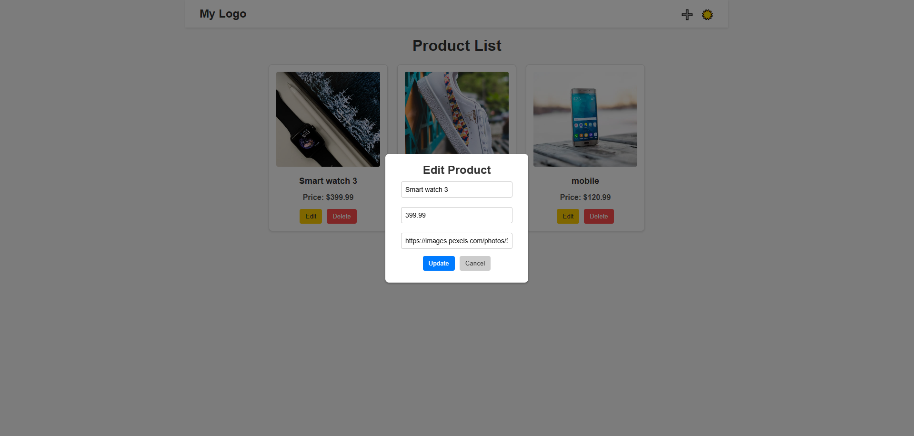
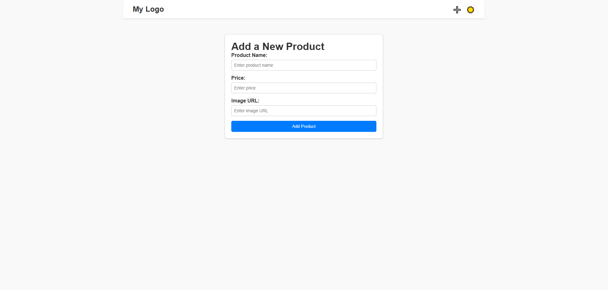
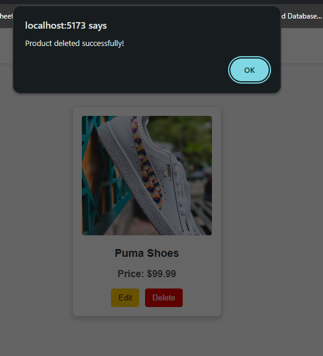
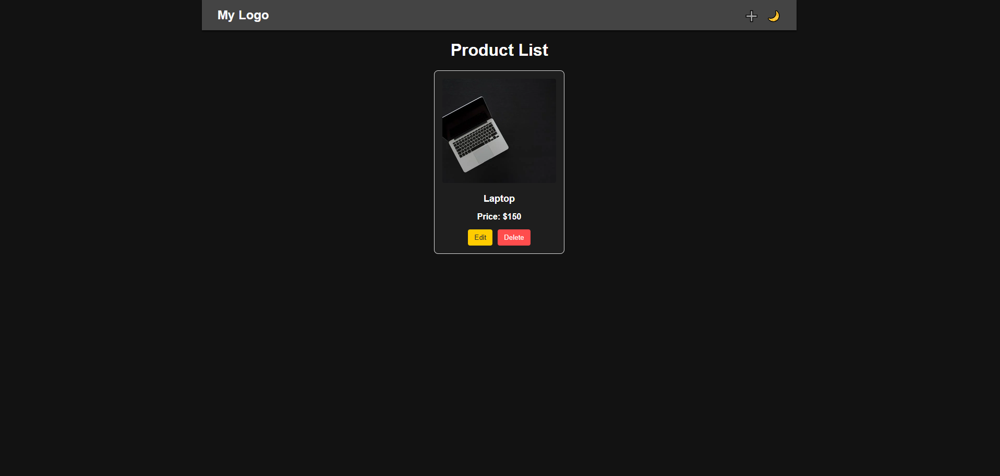

# 📦 Product Management App

A simple product management application built with **React** (frontend) and **Express.js** (backend) that allows you to **create, read, update, and delete (CRUD)** products.

---

## 🚀 Features

- ✅ Add new products  
- ✅ View a list of products  
- ✅ Edit product details  
- ✅ Delete products  
- ✅ Responsive design  

---

## 💻 Tech Stack

- **Frontend:** React, CSS, HTML  
- **Backend:** Node.js, Express.js  
- **Database:** MongoDB  
- **State Management:** React Hooks (`useState`, `useEffect`)  

---

## 🛠️ Installation

1. **Clone the repo:**

   ```bash
   git clone https://github.com/your-username/product-management-app.git
   cd product-management-app


2. **Install Dependencies**
 # Install backend dependencies
cd backend
npm install

# Install frontend dependencies
cd ../frontend
npm install


3. **set up environment**
MONGO_URI=your-mongodb-connection-string
PORT=5000


4. **Run the server**
# Start the backend
cd backend
npm start

# In a new terminal, start the frontend
cd ../frontend
npm start


## 📸 Screenshots

- **Product List:**  
  

- **Edit Product Modal:**  
  

- **Add Product:**  
  

  - **Delete Product:**  
  

- **Dark Mode:**  
  
